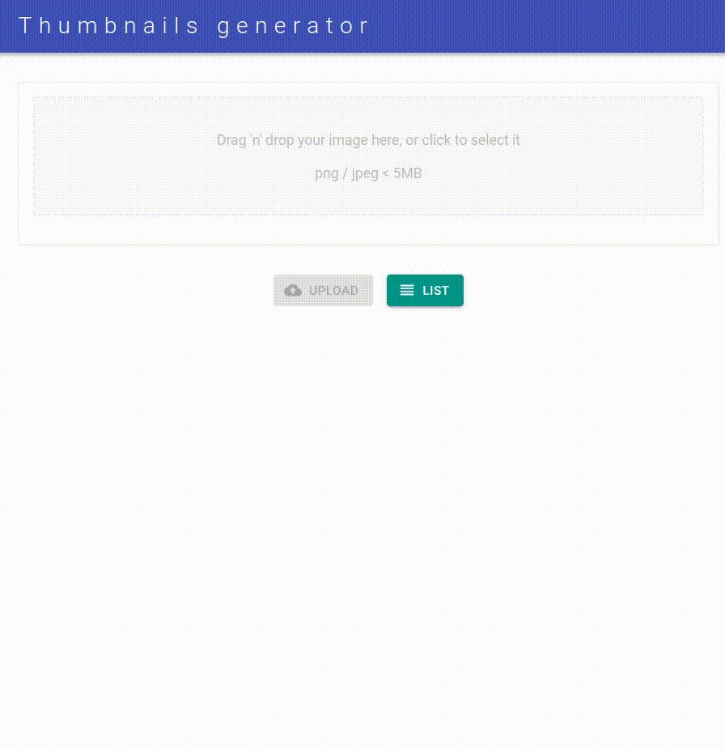

<h1 align="center">Thumbnails generator with React 📢</h1>
<p>
  
  <a href="#" target="_blank">
    
  </a>
</p>

### Description

Build a page with a drag and drop area in which you will be able to generate a 200px thumbnail version of your jpg/jpeg/png files.<br /><br />


### Backend part

This project is composed by two repositories: this one which is the React frontend and this [AWS backend](https://github.com/s4nt14go/thumbnails-aws) is the other. Start with the backend repository and then continue with this frontend.

### Instructions

1. Clone this repo and `cd` into<br /><br />
`git clone https://github.com/s4nt14go/thumbnails-react`<br /><br />
1. Create a `.env.local` file in the root folder and complete it with the data from the backend part and your credentials:<br /><br />
    ```shell script
    REACT_APP_GET_PRESIGNED_URL="outputted by CloudFormation"
    
    REACT_APP_S3_BUCKET="outputted by CloudFormation"
    REACT_APP_AWS_REGION="your aws region"
    
    REACT_APP_AWS_ACCESS_KEY="your aws account access key"
    REACT_APP_AWS_SECRET_KEY=" your aws account secret key"
    ```
1. Copy the file `schema.json` downloaded in the backend part into the `src/graphql` folder. React will need to connecto to AppSync, to do so create an `aws-exports.js` file inside the `src` folder and complete with the values from the AppSync API you created<br /><br />
    ```json
    const awsmobile = {
        "aws_project_region": "YOUR REGION",
        "aws_appsync_graphqlEndpoint": "YOUR APPSYNC API ENDPOINT",
        "aws_appsync_region": "YOUR REGION",
        "aws_appsync_authenticationType": "API_KEY",
        "aws_appsync_apiKey": "YOUR APPSYNC API KEY"
    };
    ```
   You should replace `YOUR REGION`, `YOUR APPSYNC API ENDPOINT` and `YOUR APPSYNC API KEY`, but let `API_KEY` as is.
1. 
1. Install dependencies<br /><br />
`npm i`<br /><br />
1. Run the project<br /><br />
`npm start` 
